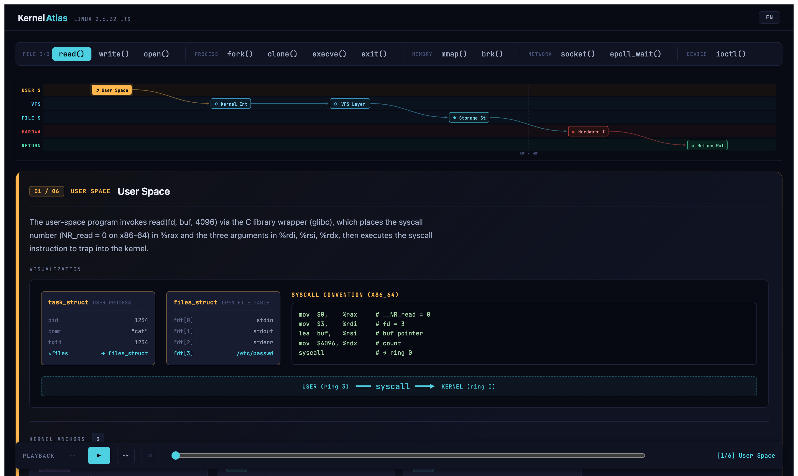
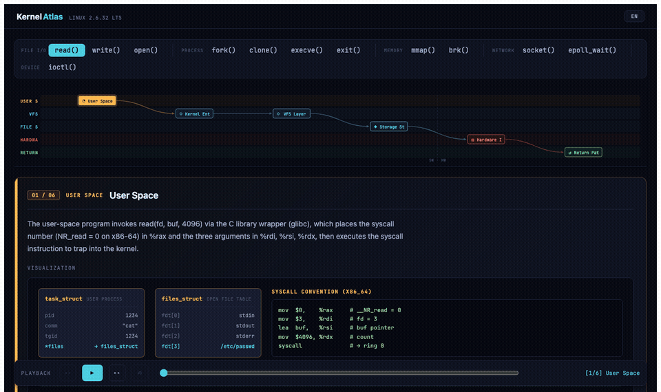
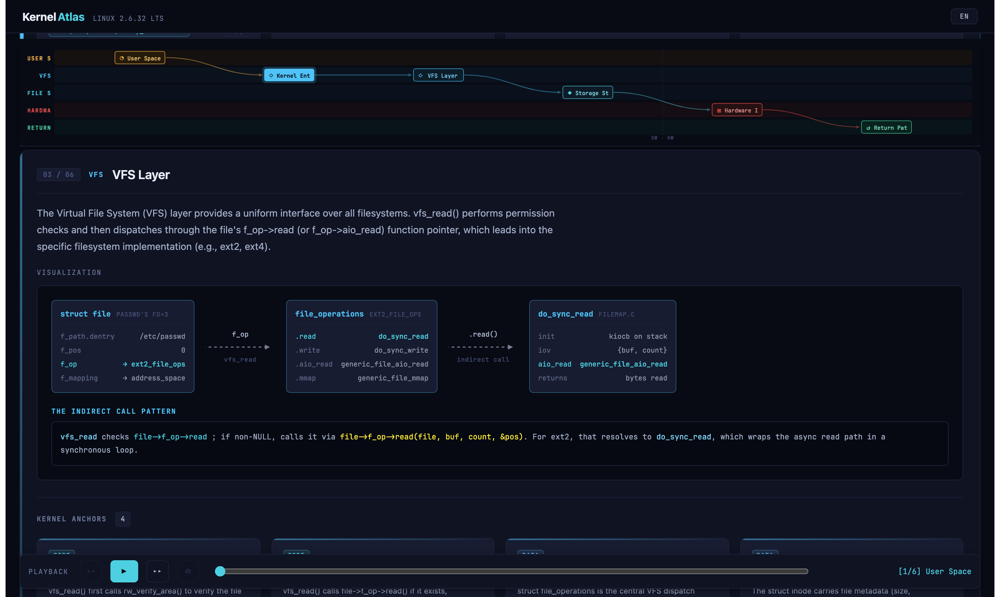
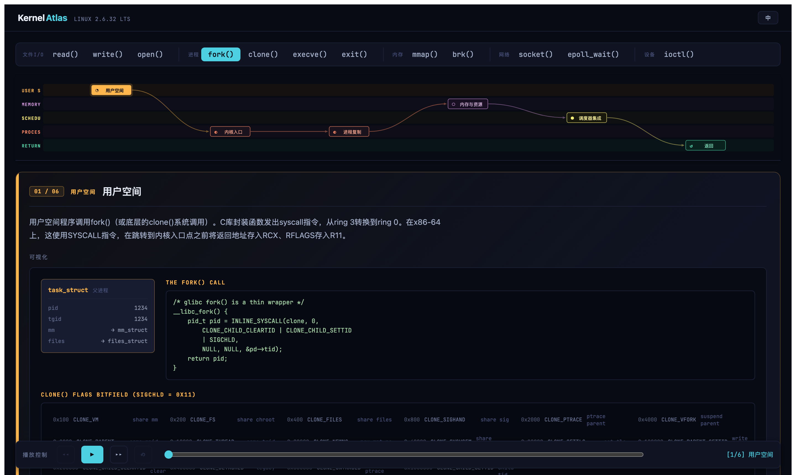

# Kernel Atlas

**An interactive map of Linux syscall internals.**

Trace what actually happens inside the kernel — stage by stage, data structure by data structure, source line by source line — based on Linux 2.6.32 LTS.





---

## Why

Reading the kernel source is hard. Call graphs are deep, data structures are interconnected, and the gap between a `read(fd, buf, 4096)` in userspace and a DMA transfer on the PCI bus is enormous.

Kernel Atlas closes that gap with a structured, interactive walkthrough. Each syscall is broken into stages. Each stage shows the key data structures, the critical function calls, and direct links to the source on [elixir.bootlin.com](https://elixir.bootlin.com/linux/v2.6.32/source).

---

## What you get

### Per-stage execution trace

Every syscall is decomposed into 5–7 stages. The mini lane strip at the top shows the full path at a glance; clicking a chip scrolls directly to that stage.



Each stage includes:
- A description of what happens and why
- The key kernel data structures involved (`struct file`, `struct inode`, `address_space`, …)
- A visualization of the execution path or data layout
- Kernel anchor cards with source references

### 12 syscalls covered

| Category | Syscalls |
|---|---|
| File I/O | `read` `write` `open` |
| Process | `fork` `clone` `execve` `exit` |
| Memory | `mmap` `brk` |
| Network | `socket` `epoll_wait` |
| Device | `ioctl` |

### English + Chinese

Every description, label, and data structure name is available in both English and Chinese. Toggle with the **EN / 中** button in the top-right corner.



### Playback

The playback bar at the bottom auto-advances through the stages with a configurable interval, useful for presentations or study sessions.

---

## Running locally

```bash
npm install
npm run dev
```

Open [http://localhost:5173](http://localhost:5173).

### Build

```bash
npm run build    # type-check + bundle → dist/
npm run preview  # serve the build locally
```

### E2E tests

```bash
npx playwright install chromium
npm run test:e2e
```

---

## Stack

- **React 18** + **TypeScript** — UI and type safety
- **Vite** — dev server and bundler
- **Playwright** — E2E test suite
- No external UI library, no CSS framework — all styles are inline design tokens

---

## Source references

All kernel source links point to Linux 2.6.32 LTS via [elixir.bootlin.com](https://elixir.bootlin.com/linux/v2.6.32/source), a stable long-term release that remains the reference kernel for many embedded and enterprise systems.

---

## License

MIT
